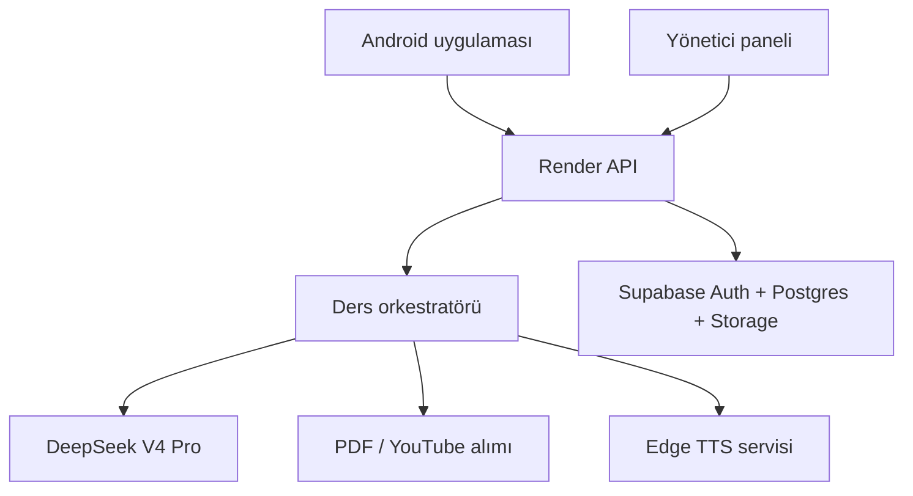
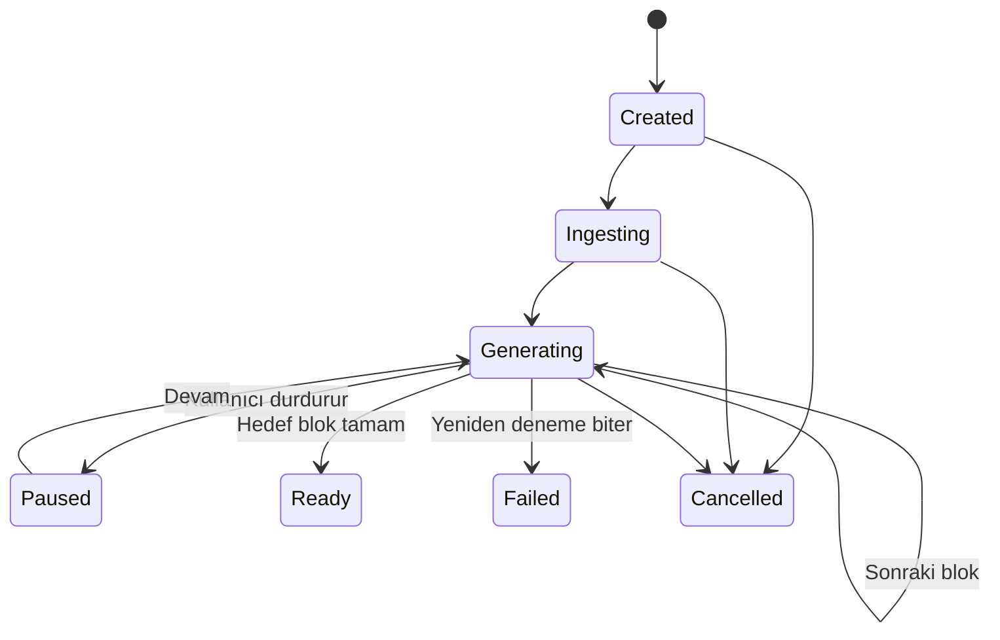

# Üretim Mimarisi

## 1. Ürün sınırı

Uygulama iki kaynak türünü işler:

1. YouTube: kullanıcı başlangıç/bitiş zamanını seçer.
2. PDF: kullanıcı başlangıç/bitiş sayfasını seçer.

Kullanıcı daha sonra bir `LessonFormat` tanımlar. Format dil öğretimi, konu anlatımı, özet, soru-cevap veya özel bir görev olabilir. Çıktı tek büyük cevap değildir; sıra numaralı ve kalıcı `LessonBlock` kayıtlarıdır. Kullanıcı kaç blok üretileceğini, her LLM isteğinin kaç blok döndüreceğini ve kart genişliğini belirler.

## 2. Sistem sınırları



DeepSeek, TTS ve içerik alımı doğrudan telefondan çağrılmaz. Bu; anahtar güvenliği, kota kontrolü, yeniden deneme, maliyet ölçümü ve ekran kapalıyken işin sunucuda devam etmesi için zorunludur.

## 3. Depo modülleri

### Android

- `app`: process başlangıcı, yönlendirme, foreground service bağlama ve dependency composition root.
- `core:model`: saf Kotlin domain nesneleri; Android API'sine bağımlı değildir.
- `core:designsystem`: Material 3 tabanlı erişilebilir tasarım sistemi.
- `core:database`: Faz 7'de Room, şifreli hassas alanlar, migration ve outbox.
- `core:network`: SSE/WebSocket, auth token yenileme ve idempotency.
- `feature:*`: ekran başına ayrı feature modülü. UI yalnızca use-case çağırır.

### Sunucu

- `domain`: sağlayıcılardan bağımsız iş nesneleri ve portlar.
- `application`: ders işi durum makinesi, kota, idempotency ve hata politikası.
- `infrastructure/deepseek`: gerçek DeepSeek Chat Completions/SSE adaptörü.
- `infrastructure/source`: PDFBox/OCR ve YouTube transcript sağlayıcıları.
- `infrastructure/supabase`: Postgres/Storage/Auth adaptörü; hesaplar gelene kadar in-memory değil, dosya tabanlı geliştirme adaptörü.
- `api`: mobil ve admin istemcilerinin çağırdığı Ktor uçları.

### TTS

`edge-tts` Python ile ayrı container'da çalışır. API, `text + voice + rate + pitch + locale` karması üzerinden aynı sesi tekrar üretmez. Edge TTS resmi bir ticari Microsoft API'si değildir; sağlayıcı portu bu nedenle değiştirebilir tasarlanır. Edge adaptörü istenen varsayılandır, ancak mağaza yayını öncesi Microsoft kullanım koşulları ayrıca doğrulanmalıdır.

## 4. Ders işi durum makinesi



Her blok için benzersiz anahtar:

```text
(lesson_id, source_revision, format_revision, block_index)
```

Yeniden deneme aynı bloğu ikinci kez oluşturmaz. İşlem tamamlanan her bloktan sonra transaction ile checkpoint yazar. Telefon kapanırsa sunucu işi sürdürür; uygulama açıldığında eksik blokları indirir.

## 5. Hız tasarımı

- DeepSeek çağrıları `stream=true` ile SSE olarak akar.
- Standart dil kartlarında `thinking.type=disabled`; karmaşık analiz formatlarında kullanıcıya açık kalite modu `enabled` kullanılır.
- İlk kart oluşurken ikinci kart için sınırlı prefetch yapılır. Kuyruk hiçbir zaman kullanıcının belirlediği üst sınırı aşmaz.
- Kaynak metin bir kez parçalanır ve içerik karmasıyla saklanır.
- LLM çıktısı JSON Schema ile doğrulanır; geçersiz küçük bölüm tüm dersi yeniden üretmez.
- TTS bir sonraki iki kart için önden hazırlanır ve cihazda indirilir.
- Ağ yoksa daha önce işlenmiş ders, kart ve sesler yalnızca Room/cache üzerinden çalışır; tekrar API ücreti oluşmaz.

Hedef servis bütçeleri, gerçek telemetriyle güncellenecektir:

| Ölçüm | Hedef |
|---|---:|
| API kabul yanıtı p95 | 250 ms altı |
| LLM ilk içerik parçası p50 | 1.5 sn altı |
| Hazır kart açılışı | 100 ms altı |
| Önbellekteki TTS başlangıcı | 250 ms altı |
| Kaydırma | 60 fps cihaz bütçesine uygun |

## 6. Format modeli

`LessonFormat` yalnızca serbest metin prompt değildir. Sürümlenmiş bir sözleşmedir:

- amaç ve öğretim dili
- hedef dil ve seviye
- kart başlıkları/alanları
- alan sırası ve görünürlüğü
- istek başına blok sayısı
- toplam blok sınırı
- kart genişliği
- ses, hız, tekrar ve otomatik ilerleme ayarları
- kullanıcıya ait ek talimat

Örnek kart alanları: kaynak cümle, hedef cümle, Türkçe anlam, Amerikan IPA, kelime açıklaması, gramer, iki örnek, mini soru. Her alan format tasarımcısında açılıp kapatılabilir.

## 7. Çevrimdışı ve senkronizasyon

Room telefondaki tek UI veri kaynağıdır. Ağ cevapları önce transaction ile Room'a yazılır, ekran Flow üzerinden güncellenir. Supabase senkronizasyonu outbox tablosuyla en az bir kez gönderilir; sunucu idempotency anahtarıyla bunu tam bir kez etkisine çevirir.

Ana tablolar:

- `profiles`, `devices`
- `sources`, `source_revisions`
- `lesson_formats`, `format_revisions`
- `lessons`, `lesson_blocks`, `lesson_progress`
- `audio_assets`, `download_entries`
- `job_runs`, `provider_usage`, `cost_ledger`
- `subscriptions`, `entitlements`
- `analytics_daily`, `admin_audit_log`

`visibility = private | unlisted | public`. Private kayıtlarda RLS yalnızca sahibine izin verir. Public ders yayınlandığında değişmez bir sürüm oluşur; başka kullanıcı düzenlemek isterse fork alır.

## 8. Ekran kapalı çalışma

İçerik üretimi telefonda değil sunucuda sürdüğü için uygulamanın process'i açık kalmak zorunda değildir. Sesli ders ve mikrofon komutları farklıdır:

- TTS oynatma Media3 playback foreground service ve görünür bildirim ile sürer.
- Mikrofon komutu, kullanıcı uygulama görünürken başlattığı `microphone` türünde foreground service ile sürer.
- Android uygulamayı zorla durdurursa veya kullanıcı izni kapatırsa mikrofon devam edemez.
- Sürekli ham ses sunucuya gönderilmez. Komut tanıma mümkün olduğunda cihazda, yalnızca komut sonucu sunucuya gider.

## 9. Abonelik ve haklar

Google Play Billing istemcisi satın alma akışını başlatır; yetkiyi tek başına vermez. Purchase token sunucuda Google Play Developer API ile doğrulanır. `Entitlement` kaydı süre, plan, askıya alınma ve iptal durumunu içerir. LLM/TTS kotaları server-side kontrol edilir.

Önerilen plan boyutları:

- Ücretsiz: sınırlı aylık blok ve TTS karakteri
- Pro: yüksek blok, arka plan işi, özel formatlar ve indirme
- Pro Plus: daha yüksek bağlam, kalite modu ve yayınlama

Fiyatlar kodda sabitlenmez; Play Console ürünlerinden okunur.

## 10. Yönetici paneli

Ayrı `admin-web` istemcisi sadece admin JWT ile yönetim API'sine bağlanır. Ham özel ders içeriği analitik ekranına taşınmaz.

Paneller:

- DAU/WAU/MAU ve kayıt büyümesi
- deneme, aktif abonelik, dönüşüm, churn ve gelir
- toplam ders/kaynak/blok ve public/private dağılımı
- DeepSeek input/output token, istek, hata, p50/p95 gecikme ve tahmini maliyet
- TTS karakteri, ses süresi, cache hit ve maliyet
- Render trafik, hata oranı, kuyruk derinliği ve worker süresi
- kullanıcı/proje bazlı kota ve abuse sinyalleri
- değiştirilemez admin audit log

## 11. Güvenlik

- API anahtarları Android BuildConfig'e dahi eklenmez.
- Supabase service role anahtarı yalnızca backend secret store'dadır.
- RLS tüm kullanıcı tablolarında varsayılan kapalı erişimle başlar.
- PDF upload'ları imzalı URL ve sınırlı boyut/MIME ile kabul edilir.
- Prompt injection'a karşı kaynak metin talimat değil veri olarak işaretlenir.
- LLM çıktısı şema, boyut ve güvenli Markdown filtresinden geçer.
- Her maliyet oluşturan çağrı kullanıcı, iş ve idempotency anahtarıyla kaydedilir.
- Public içerik için raporlama, moderasyon ve kaldırma akışı zorunludur.

## 12. Güncel teknik taban

- Android Gradle Plugin 9.2.1 / Gradle 9.4.1 / JDK 17
- Android compile/target SDK 36, min SDK 26
- Kotlin 2.3.21 (AGP built-in Kotlin ile uyumlu kararlı hata düzeltme sürümü)
- Compose BOM 2026.06.00, Activity 1.13.0, Navigation 2.9.8
- Play Billing 9.1.0
- Ktor 3.5.1
- DeepSeek `deepseek-v4-pro`, streaming Chat Completions
- Edge TTS 7.2.8 servis adaptörü
